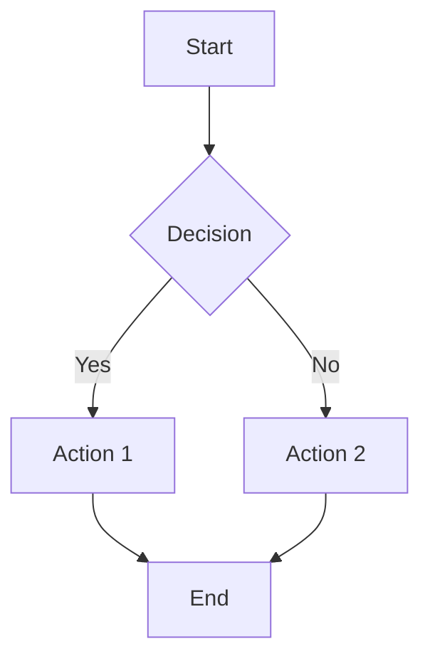
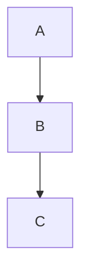
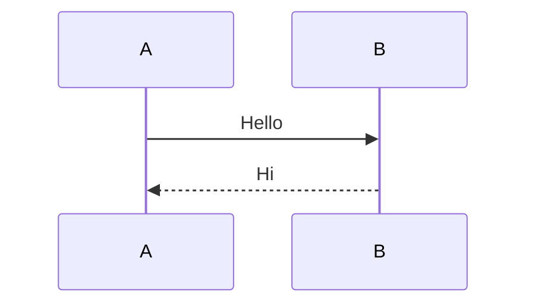
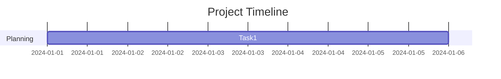
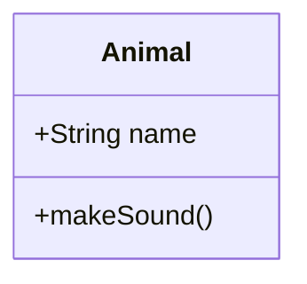
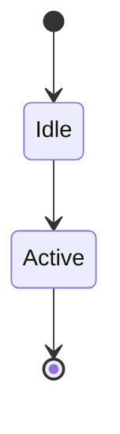

# drawiopro

A simple, standalone web tool for creating, editing, and exporting Mermaid diagrams. No server or installation required - just open the HTML file in your browser.

## Features

- **Code Editor** - Write Mermaid syntax with line/column tracking
- **Live Preview** - Render diagrams instantly on a canvas
- **Templates** - Quick-start templates for multiple diagram types
- **Load/Save** - Import and export Mermaid code files
- **Export SVG** - Download rendered diagrams as SVG images
- **Dark/Light UI** - Editor in dark mode, preview in light mode for clarity
- **Resizable Panels** - Drag divider to adjust panel sizes
- **Keyboard Shortcuts** - `Ctrl+Enter` / `Cmd+Enter` to render

## How to Use

### 1. Open the Editor

Simply open the HTML file in your browser:

```bash
open mermaid-editor.html
```

Or double-click `mermaid-editor.html` in Finder.

### 2. Write Mermaid Code

Use the left panel to write your Mermaid diagram code.

### 3. Render the Diagram

- Click the **Render** button
- Or press `Ctrl+Enter` (Windows/Linux) or `Cmd+Enter` (Mac)

### 4. View the Result

The rendered diagram appears in the right panel.

### 5. Save or Export

| Button | Action |
|--------|--------|
| Load File | Import `.mmd`, `.mermaid`, or `.txt` file |
| Save | Export Mermaid code as `.mmd` file |
| Export SVG | Download diagram as SVG image |

## Available Templates

| Template | Description |
|----------|-------------|
| Flowchart | Process flows and decision trees |
| Sequence | System interactions over time |
| Gantt | Project timelines |
| Class Diagram | Object-oriented class structures |
| State | State machine diagrams |

## Example - Flowchart



## Mermaid Syntax Basics

### Flowchart


### Sequence Diagram


### Gantt Chart


### Class Diagram


### State Diagram


## Supported Diagram Types

- Flowcharts (`graph TD` / `graph LR`)
- Sequence Diagrams (`sequenceDiagram`)
- Gantt Charts (`gantt`)
- Class Diagrams (`classDiagram`)
- State Diagrams (`stateDiagram-v2`)
- ER Diagrams (`erDiagram`)
- Pie Charts (`pie`)
- Mindmaps (`mindmap`)
- And many more...

## Tips

1. **Resize panels** - Drag the vertical divider between editor and preview
2. **Quick render** - Use `Ctrl+Enter` or `Cmd+Enter` keyboard shortcut
3. **Scroll preview** - If diagram is large, use scrollbars in preview panel
4. **Export** - SVG exports work great for presentations and documents
5. **Templates** - Start with a template to learn the syntax

## Requirements

- A modern web browser (Chrome, Firefox, Safari, Edge)
- Internet connection (loads Mermaid.js from CDN)

## Offline Use

The editor loads Mermaid.js from a CDN. To use offline, download the library and update the script tag:

```html
<script src="mermaid.min.js"></script>
```

## License

This tool is part of the draw.io Pro project.
